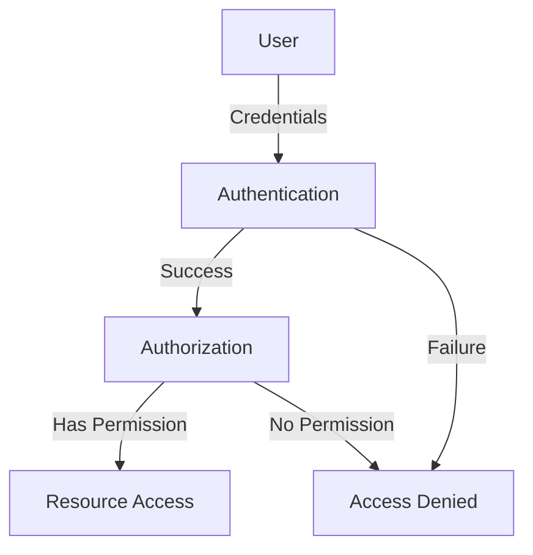
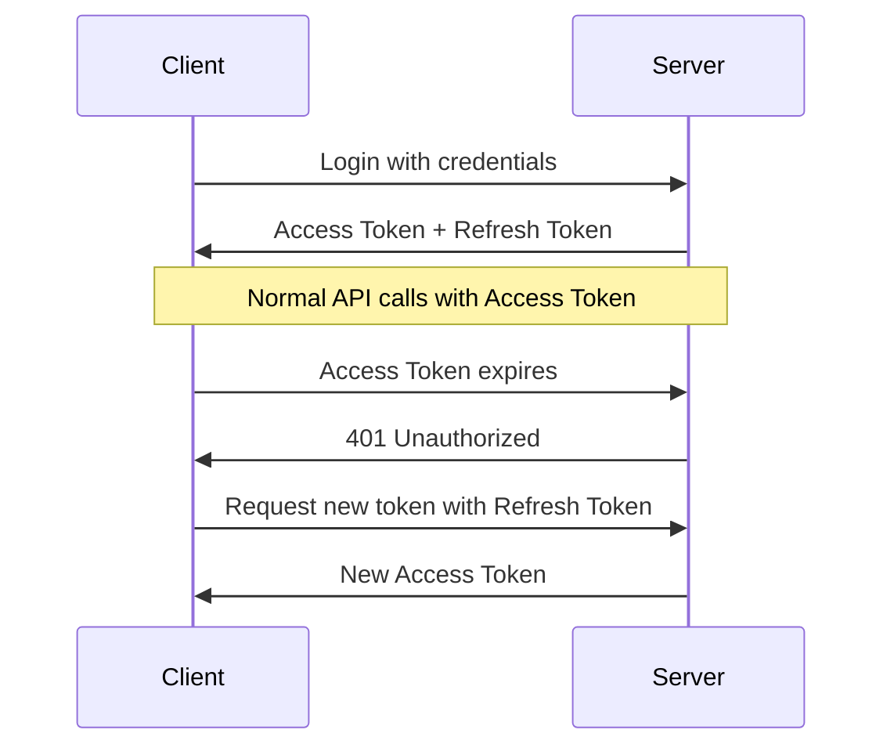

# Understanding Authentication, Authorization, and JWT Tokens

## Table of Contents
- [Understanding Authentication, Authorization, and JWT Tokens](#understanding-authentication-authorization-and-jwt-tokens)
  - [Authentication vs Authorization](#authentication-vs-authorization)
  - [JWT (JSON Web Token)](#jwt-json-web-token)
  - [Token Refresh Mechanism](#token-refresh-mechanism)
  - [Logout Implementation](#logout-implementation)
  - [Best Practices](#best-practices)
  - [Implementation Guide](#implementation-guide)

## Authentication vs Authorization

Authentication and authorization are two fundamental concepts in application security, each serving a distinct purpose in protecting resources and managing user access.

### Key Differences

| Aspect | Authentication | Authorization |
|--------|----------------|---------------|
| Purpose | Verifies who you are | Determines what you can do |
| Question it Answers | "Are you who you claim to be?" | "Do you have permission to access this?" |
| Timing | Happens first | Happens after authentication |
| Example | Logging into an application | Accessing specific features or resources |

### Real-World Analogy

Consider entering a company building:
- **Authentication**: Using your ID card to enter the building
- **Authorization**: Having permission to access specific rooms or floors inside



## JWT (JSON Web Token)

JWT is a compact, URL-safe means of representing claims between two parties. It's widely used for authentication and information exchange.

### Structure

A JWT consists of three parts:

1. **Header (Red Part)**
   ```json
   {
     "alg": "HS256",
     "typ": "JWT"
   }
   ```

2. **Payload (Violet Part)**
   ```json
   {
     "sub": "1234567890",
     "name": "John Doe",
     "iat": 1516239022
   }
   ```

3. **Signature (Blue Part)**
   ```plaintext
   HMACSHA256(
     base64UrlEncode(header) + "." +
     base64UrlEncode(payload),
     your-256-bit-secret
   )
   ```

### Why Choose JWT?

#### Advantages over Basic Authentication:
- Eliminates the need to send credentials with every request
- Supports token expiration for enhanced security
- Can contain useful payload data
- Enables stateless authentication
- More secure than transmitting username/password

#### Security Considerations:
- Token expiration should be tailored to application sensitivity
- High-security applications (e.g., banking): Short expiration time (minutes)
- Standard applications: Longer expiration time (hours)

## Token Refresh Mechanism

To handle token expiration gracefully while maintaining user experience:



## Logout Implementation

JWT-based logout has specific characteristics:

- Server-side token invalidation is not native to JWT
- Logout functionality is primarily client-side
- Client responsibilities include:
  - Token storage management (localStorage, cookies)
  - Token removal during logout
  - Token inclusion in requests
  - Expiration handling

## Best Practices

### 1. Token Storage
- Implement secure storage mechanisms
- Consider HTTP-only cookies for web applications
- Use appropriate mobile storage solutions

### 2. Security Measures
- Configure appropriate token expiration times
- Implement refresh token rotation
- Enforce HTTPS for all API communications
- Validate tokens on every request

### 3. Error Handling
- Handle expired tokens gracefully
- Provide clear unauthorized access messages
- Implement automatic login redirects

## Implementation Guide

### Token Lifetime Recommendations

| Security Level | Application Type | Recommended Lifetime |
|---------------|------------------|---------------------|
| High | Banking, Financial | 5-15 minutes |
| Medium | Business Applications | 30-60 minutes |
| Low | Content Sites | 1-24 hours |

### Authorization Header Format
```http
Authorization: Bearer <token>
```

### Backend Responsibilities
1. Token generation
2. Token validation
3. Refresh token management
4. Security implementation

### Frontend Responsibilities
1. Token storage
2. Token transmission
3. Expiration handling
4. Logout implementation

### Common Implementation Patterns

```javascript
// Frontend Token Storage
localStorage.setItem('token', 'your-jwt-token');

// Adding Token to Requests
fetch(url, {
  headers: {
    'Authorization': `Bearer ${localStorage.getItem('token')}`
  }
});

// Handling Token Expiration
if (response.status === 401) {
  // Initiate token refresh flow
  refreshToken();
}
```

Remember: The separation of concerns between frontend and backend is crucial for maintaining a secure authentication system. The backend focuses on token generation and validation, while the frontend manages token storage and transmission.

---

## Final Notes

- JWT provides a robust solution for modern authentication needs
- Balance security and user experience when setting token lifetimes
- Implement proper error handling and token refresh mechanisms
- Follow security best practices for token storage and transmission
- Consider your application's specific needs when implementing authentication

This documentation is part of ongoing security implementation guides. For updates and more details, check the repository's wiki or related documentation.
