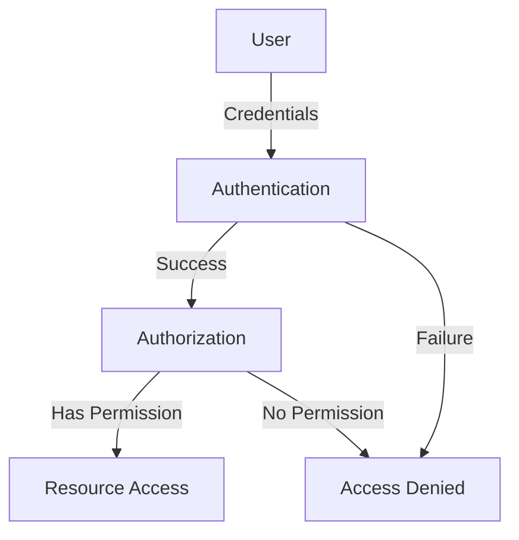
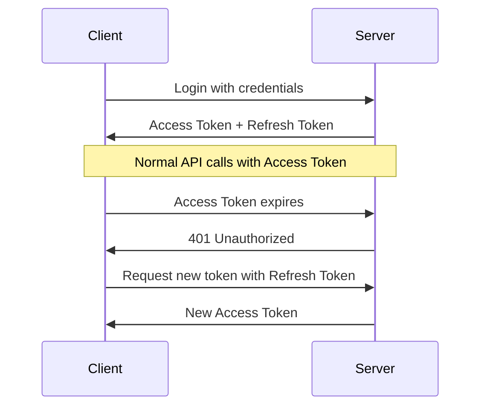
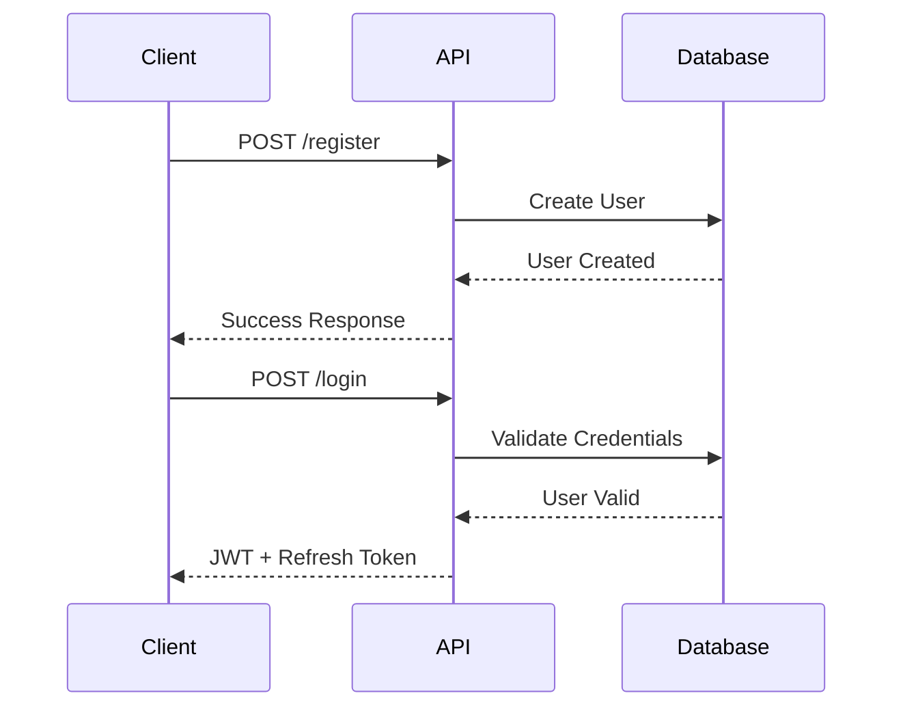

# Understanding Authentication, Authorization, and JWT Tokens

## Table of Contents
- [Understanding Authentication, Authorization, and JWT Tokens](#understanding-authentication-authorization-and-jwt-tokens)
  - [Authentication vs Authorization](#authentication-vs-authorization)
  - [JWT (JSON Web Token)](#jwt-json-web-token)
  - [Token Refresh Mechanism](#token-refresh-mechanism)
  - [Logout Implementation](#logout-implementation)
  - [Best Practices](#best-practices)
  - [Implementation Guide](#implementation-guide)

## Authentication vs Authorization

Authentication and authorization are two fundamental concepts in application security, each serving a distinct purpose in protecting resources and managing user access.

### Key Differences

| Aspect | Authentication | Authorization |
|--------|----------------|---------------|
| Purpose | Verifies who you are | Determines what you can do |
| Question it Answers | "Are you who you claim to be?" | "Do you have permission to access this?" |
| Timing | Happens first | Happens after authentication |
| Example | Logging into an application | Accessing specific features or resources |

### Real-World Analogy

Consider entering a company building:
- **Authentication**: Using your ID card to enter the building
- **Authorization**: Having permission to access specific rooms or floors inside



## JWT (JSON Web Token)

JWT is a compact, URL-safe means of representing claims between two parties. It's widely used for authentication and information exchange.

### Structure

A JWT consists of three parts:

1. **Header (Red Part)**
   ```json
   {
     "alg": "HS256",
     "typ": "JWT"
   }
   ```

2. **Payload (Violet Part)**
   ```json
   {
     "sub": "1234567890",
     "name": "John Doe",
     "iat": 1516239022
   }
   ```

3. **Signature (Blue Part)**
   ```plaintext
   HMACSHA256(
     base64UrlEncode(header) + "." +
     base64UrlEncode(payload),
     your-256-bit-secret
   )
   ```

### Why Choose JWT?

#### Advantages over Basic Authentication:
- Eliminates the need to send credentials with every request
- Supports token expiration for enhanced security
- Can contain useful payload data
- Enables stateless authentication
- More secure than transmitting username/password

#### Security Considerations:
- Token expiration should be tailored to application sensitivity
- High-security applications (e.g., banking): Short expiration time (minutes)
- Standard applications: Longer expiration time (hours)

## Token Refresh Mechanism

To handle token expiration gracefully while maintaining user experience:



## Logout Implementation

JWT-based logout has specific characteristics:

- Server-side token invalidation is not native to JWT
- Logout functionality is primarily client-side
- Client responsibilities include:
  - Token storage management (localStorage, cookies)
  - Token removal during logout
  - Token inclusion in requests
  - Expiration handling

## Best Practices

### 1. Token Storage
- Implement secure storage mechanisms
- Consider HTTP-only cookies for web applications
- Use appropriate mobile storage solutions

### 2. Security Measures
- Configure appropriate token expiration times
- Implement refresh token rotation
- Enforce HTTPS for all API communications
- Validate tokens on every request

### 3. Error Handling
- Handle expired tokens gracefully
- Provide clear unauthorized access messages
- Implement automatic login redirects

## Implementation Guide

### Token Lifetime Recommendations

| Security Level | Application Type | Recommended Lifetime |
|---------------|------------------|---------------------|
| High | Banking, Financial | 5-15 minutes |
| Medium | Business Applications | 30-60 minutes |
| Low | Content Sites | 1-24 hours |

### Authorization Header Format
```http
Authorization: Bearer <token>
```

### Backend Responsibilities
1. Token generation
2. Token validation
3. Refresh token management
4. Security implementation

### Frontend Responsibilities
1. Token storage
2. Token transmission
3. Expiration handling
4. Logout implementation

### Common Implementation Patterns

```javascript
// Frontend Token Storage
localStorage.setItem('token', 'your-jwt-token');

// Adding Token to Requests
fetch(url, {
  headers: {
    'Authorization': `Bearer ${localStorage.getItem('token')}`
  }
});

// Handling Token Expiration
if (response.status === 401) {
  // Initiate token refresh flow
  refreshToken();
}
```

Remember: The separation of concerns between frontend and backend is crucial for maintaining a secure authentication system. The backend focuses on token generation and validation, while the frontend manages token storage and transmission.

---

## Final Notes

- JWT provides a robust solution for modern authentication needs
- Balance security and user experience when setting token lifetimes
- Implement proper error handling and token refresh mechanisms
- Follow security best practices for token storage and transmission
- Consider your application's specific needs when implementing authentication

This documentation is part of ongoing security implementation guides. For updates and more details, check the repository's wiki or related documentation.

# ASP.NET Core Identity Implementation Guide

## Introduction
ASP.NET Core Identity is a powerful membership system that provides a built-in solution for managing users, roles, and permissions. This guide covers the basic implementation and customization of Identity in your application.

## Key Features
- Pre-built database schema for user management
- Built-in authentication and authorization
- Extensible user and role management
- Secure password hashing and storage
- Claims-based identity support

## Implementation Steps

### 1. Setting Up Identity DbContext

First, modify your `ApplicationDbContext` to inherit from `IdentityDbContext`:

```csharp
public class ApplicationDbContext : IdentityDbContext<ApplicationUser>
{
    public ApplicationDbContext(DbContextOptions<ApplicationDbContext> options) 
        : base(options)
    {
    }

    public DbSet<Poll> Polls { get; set; }

    protected override void OnModelCreating(ModelBuilder modelBuilder)
    {
        modelBuilder.ApplyConfigurationsFromAssembly(Assembly.GetExecutingAssembly());
        base.OnModelCreating(modelBuilder);
    }
}
```

### 2. Installing Required Package
```powershell
Install-Package Microsoft.AspNetCore.Identity.EntityFrameworkCore
```

### 3. Creating Custom User Class

Create a custom user class that extends `IdentityUser`:

```csharp
public sealed class ApplicationUser : IdentityUser
{
    public string FirstName { get; set; } = string.Empty;
    public string LastName { get; set; } = string.Empty;
}
```

### 4. Configuring User Properties

Create a configuration class for the custom user properties:

```csharp
public class UserConfiguration : IEntityTypeConfiguration<ApplicationUser>
{
    public void Configure(EntityTypeBuilder<ApplicationUser> builder)
    {
        builder.Property(u => u.FirstName).HasMaxLength(100);
        builder.Property(u => u.LastName).HasMaxLength(100);
    }
}
```

### 5. Database Migration

Run the following commands to create and apply the Identity schema:

```powershell
Add-Migration AddIdentityTables
Update-Database
```

## Generated Database Schema

Identity creates several tables automatically:

| Table Name | Purpose |
|------------|---------|
| AspNetUsers | Stores user information |
| AspNetRoles | Stores role information |
| AspNetUserRoles | Maps users to roles |
| AspNetUserClaims | Stores user claims |
| AspNetRoleClaims | Stores role claims |
| AspNetUserLogins | Manages external login providers |
| AspNetUserTokens | Stores user tokens |

## Customization Tips

### Adding Custom Columns
1. Define properties in `ApplicationUser` class
2. Create configuration using `EntityTypeConfiguration`
3. Apply configurations in `OnModelCreating`

### Removing Unwanted Columns
Use the `Ignore()` method in configurations:

```csharp
builder.Ignore(u => u.UnwantedProperty);
```

> **Note**: It's recommended to keep default Identity columns unless absolutely necessary to remove them, as they may be required for certain Identity features.

## Best Practices

1. **Custom User Properties**
   - Keep custom properties relevant to user identity
   - Use appropriate data types and constraints
   - Document any custom properties added

2. **Database Schema**
   - Avoid modifying default Identity tables structure
   - Use migrations for all schema changes
   - Back up database before applying migrations

3. **Configuration**
   - Keep configurations in separate files
   - Use fluent API for complex configurations
   - Follow naming conventions

## Future Expansion

Identity can be expanded to include:
- Custom role management
- Claims-based authorization
- External authentication providers
- Custom password validation
- Two-factor authentication

## Code Organization

```plaintext
YourProject/
├── Data/
│   ├── ApplicationDbContext.cs
│   └── Configurations/
│       └── UserConfiguration.cs
├── Models/
│   └── ApplicationUser.cs
└── Migrations/
    └── [Generated Migrations]
```

## Next Steps
- Implement user management features
- Configure authentication and authorization
- Set up role-based access control
- Add external login providers
- Implement security policies

This documentation provides a foundation for implementing ASP.NET Core Identity. As your application grows, you can expand upon these basics to implement more advanced features and security measures.


# ASP.NET Core 8 Identity API Endpoints

## Introduction
.NET 8 introduces a significant improvement in Identity implementation by providing built-in API endpoints. This new feature reduces boilerplate code but currently has limited customization options.

## Key Features
- Auto-generated authentication endpoints
- Built-in JWT token generation
- Automatic refresh token handling
- Ready-to-use registration and login flows

## Implementation

### 1. Service Registration
Add the following in your `Program.cs`:

```csharp
builder.Services.AddIdentityApiEndpoints<ApplicationUser>()
    .AddEntityFrameworkStores<ApplicationDbContext>();
```

### 2. Middleware Configuration
Add after authorization middleware:

```csharp
app.MapIdentityApi<ApplicationUser>();
```

## Generated Endpoints

| Endpoint | Method | Purpose |
|----------|--------|----------|
| `/register` | POST | User registration |
| `/login` | POST | User authentication |
| `/refresh` | POST | Refresh token |
| `/logout` | POST | User logout |

## Request Examples

### Registration
```json
{
    "email": "user@example.com",
    "password": "Password123!"
}
```

### Login
```json
{
    "email": "user@example.com",
    "password": "Password123!"
}
```

## Authentication Options

```csharp
builder.Services.AddIdentityApiEndpoints<ApplicationUser>(options => 
{
    options.SignIn.RequireConfirmedAccount = false;
    options.Cookie.HttpOnly = true;
    options.Cookie.SameSite = SameSiteMode.Strict;
})
```

## Current Limitations

### 1. Customization Restrictions
- Cannot modify default endpoint behavior
- Limited ability to add custom fields
- Custom columns (like FirstName, LastName) won't be populated automatically

### 2. Configuration Constraints
- Fixed token lifetime
- Predetermined JWT configuration
- Limited middleware pipeline customization

## Usage Considerations

### Advantages
1. Quick implementation
2. Zero boilerplate code
3. Secure default configuration
4. Built-in token management

### Disadvantages
1. Limited customization
2. No control over token generation
3. Fixed endpoint routes
4. Cannot modify response structure

## Example Flow



## Best Practices

1. **Development Environment**
   - Use for rapid prototyping
   - Perfect for proof of concept
   - Ideal for simple applications

2. **Production Environment**
   - Consider custom implementation for complex requirements
   - Implement custom endpoints for additional fields
   - Use traditional Identity setup for full control

3. **Testing**
   - Test all auto-generated endpoints
   - Verify token handling
   - Check refresh token mechanism

## Future Outlook

- .NET 9 preview maintains these limitations
- Custom implementations still recommended for production applications
- Microsoft may add customization options in future releases

## Sample Configuration

```csharp
builder.Services.AddIdentityApiEndpoints<ApplicationUser>(options =>
{
    // Authentication settings
    options.SignIn.RequireConfirmedAccount = false;
    options.SignIn.RequireConfirmedEmail = false;
    
    // Password settings
    options.Password.RequireDigit = true;
    options.Password.RequireLowercase = true;
    options.Password.RequireUppercase = true;
    options.Password.RequireNonAlphanumeric = true;
    options.Password.RequiredLength = 8;
    
    // Lockout settings
    options.Lockout.DefaultLockoutTimeSpan = TimeSpan.FromMinutes(5);
    options.Lockout.MaxFailedAccessAttempts = 5;
    
    // Cookie settings
    options.Cookie.HttpOnly = true;
    options.Cookie.SecurePolicy = CookieSecurePolicy.Always;
})
```

## Conclusion
While .NET 8's Identity API Endpoints offer a quick and secure way to implement authentication, their current limitations make them more suitable for simple applications or prototypes. For production applications requiring customization, traditional Identity implementation remains the recommended approach.

---

This implementation guide will be updated as Microsoft releases new features and customization options in future versions.
